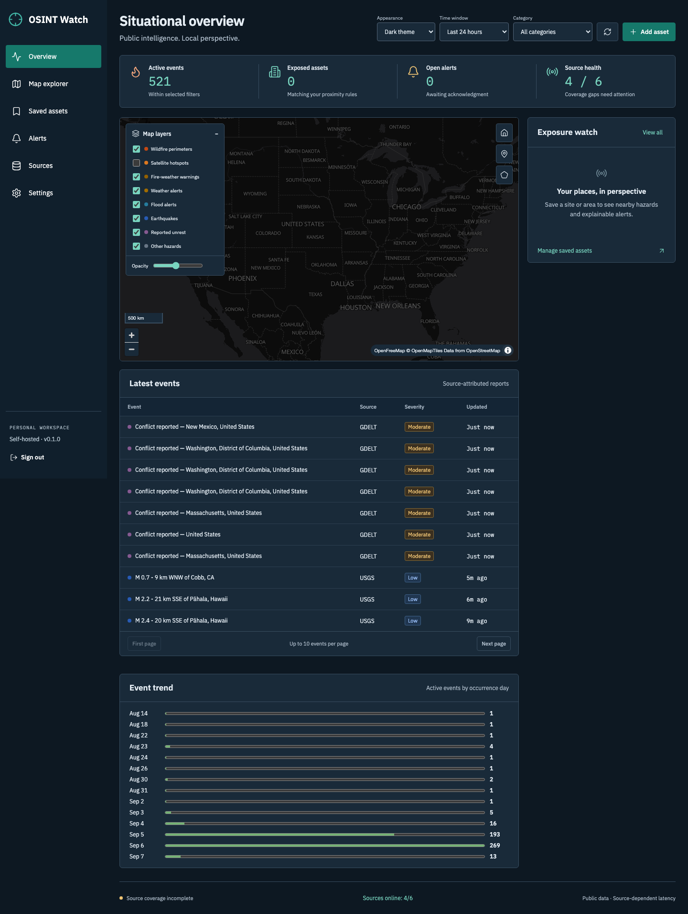
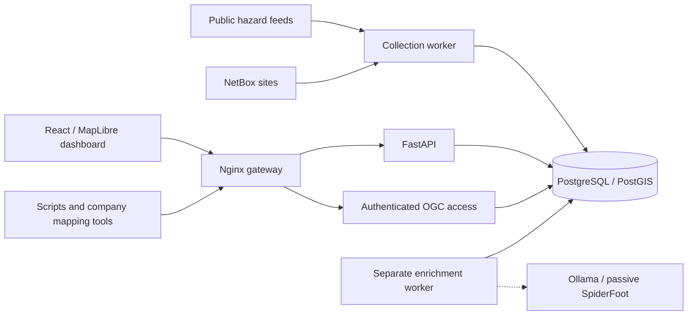

<div align="center">

# OSINT Watch

**Public intelligence. Local perspective.**

A self-hosted physical-risk monitoring platform that brings public hazard feeds,
saved locations, and explainable exposure into one map—with an API built for integration.

[Quick start](#quick-start) · [Data sources](#public-data-sources) · [API & GIS](#api--gis-integration) · [Documentation](#documentation) · [Roadmap](roadmap.md)

</div>

---

OSINT Watch helps you answer three questions: **What is happening? Which of my sites
are nearby? What evidence supports the alert?** It collects public wildfire,
earthquake, weather, flood, and news-derived unrest data into a local database, then
evaluates those events against the places you care about.

Run it on a homelab server, monitor locations imported from NetBox, or connect its
GeoJSON, vector tiles, and REST API to an existing company mapping tool. The dashboard
and external clients use the same versioned API.

> **Current scope:** An initial implementation for one administrator and one workspace,
> with US-focused monitoring and selected global feeds. Exposure describes a spatial
> relationship to a reported hazard; it is not a prediction of damage or a guarantee
> of safety. See the [verification record](docs/verification.md) for tested behavior
> and remaining limitations.

<details>
<summary><strong>Preview the dashboard in dark mode</strong></summary>



_Captured during local verification. Displayed events and counts are historical,
not a live status report. No private saved sites are shown._

</details>

## What you can do

| Capability                   | How it helps                                                                                                                                                     |
| ---------------------------- | ---------------------------------------------------------------------------------------------------------------------------------------------------------------- |
| **Explore hazards on a map** | Toggle independent layers, adjust opacity, filter by time and category, and inspect evidence alongside the map. Clustering and vector tiles support dense views. |
| **Monitor your locations**   | Place sites on the map, draw areas, or import CSV coordinates and GeoJSON boundaries. Configure distance, category, and severity rules for each asset.           |
| **Understand exposure**      | See which hazards intersect or fall within a configured distance of an asset. Review the spatial explanation, acknowledge alerts, and track their resolution.    |
| **Sync NetBox sites**        | Import names and coordinates on demand or hourly while keeping local exposure rules intact. Missing or unlocated imports are explicitly flagged.                 |
| **Inspect source quality**   | Check freshness, failures, rejected records, revisions, and evidence links. Missing coverage remains visible instead of appearing as “all clear.”                |
| **Connect other systems**    | Use scoped API tokens, GeoJSON, vector tiles, read-only OGC API Features, incremental event synchronization, and signed webhooks.                                |
| **Choose your appearance**   | Switch between Light, Dark, and System themes. Preferences persist in your browser; the default basemap also has a dark style.                                   |
| **Add optional enrichment**  | Request evidence-linked Ollama summaries or manually trigger passive SpiderFoot enrichment for asset-associated domains and IPs.                                 |

## Quick start

### 1. Prepare your host

Install Git, Python 3 for the setup script, and Docker with Compose. Allow internet
access for public feeds, container builds, and the configured basemap.

| Resource     | Planning target                                                                            |
| ------------ | ------------------------------------------------------------------------------------------ |
| CPU          | Approximately 4 cores                                                                      |
| Memory       | Approximately 8 GB for the core stack                                                      |
| Storage      | Approximately 100 GB SSD; actual use depends on feeds, retention, and backups              |
| Architecture | PostGIS and GIS services currently use amd64; ARM hosts run those services under emulation |

These are deployment targets, not certified capacity guarantees. Local AI requires
additional memory and model storage. See [performance measurements](docs/verification.md#performance).

### 2. Clone, configure, and start

```sh
git clone https://github.com/thespookypacket/OSINT-Watch.git
cd OSINT-Watch
python3 scripts/setup.py
docker compose up -d --build
```

The setup script creates a private `.env` with unique credentials and does not print
their values. If `.env` already exists, it leaves it unchanged; edit that file and
skip the setup step when reusing an installation. Never commit `.env`.

### 3. Open your watch

Open **[http://localhost:8080](http://localhost:8080)**. Sign in as `admin` using
`WATCH_ADMIN_PASSWORD` from your local `.env` file.

1. Open **Sources** to check collection progress and any configuration gaps. Initial
   collection can take several minutes.
2. Add a saved site or area, import your locations, or configure NetBox synchronization.
3. Explore the map and inspect event evidence. Exposure appears when an event matches
   an asset's spatial and severity rules.
4. Choose **Appearance → Light, Dark, or System** in the header.

The core platform operates without NetBox, NASA FIRMS credentials, Ollama, or SpiderFoot.

## Public data sources

Connectors fetch and retain event data locally; the platform does more than link to
external maps. Each event keeps its source identity, attribution, timestamps,
geometry when available, and evidence references.

| Source           | Current use                                                                               | Configuration                                                                                |
| ---------------- | ----------------------------------------------------------------------------------------- | -------------------------------------------------------------------------------------------- |
| **USGS**         | Global earthquake baseline                                                                | Enabled by default                                                                           |
| **NWS**          | US severe weather, flood, and fire-weather alerts; official zone geometry where available | Enabled by default                                                                           |
| **NIFC / WFIGS** | US wildfire perimeters updated within the last 14 days                                    | Enabled by default                                                                           |
| **NASA FIRMS**   | NOAA-20 VIIRS thermal detections within a US-region bounding box                          | Set `WATCH_FIRMS_KEY` to a [NASA map key](https://firms.modaps.eosdis.nasa.gov/api/map_key/) |
| **GDACS**        | Recent global multi-hazard context                                                        | Enabled by default                                                                           |
| **GDELT**        | US-location demonstration and conflict signals derived from news coding                   | Enabled by default; reports are unverified signals                                           |

**Three fire layers, three different meanings:** satellite hotspots are thermal
detections; wildfire perimeters are reported boundaries; fire-weather alerts describe
conditions. A hotspot is not automatically a confirmed wildfire. Peaceful
demonstrations receive low severity by default, and news coding does not establish a
verified threat.

Add public **GeoJSON, ArcGIS FeatureServer, or RSS/Atom** feeds through **Sources**.
Field mappings, polling, geometry handling, and collection limits are documented in
the [connector guide](docs/connectors.md). Missing geometry is retained in the event
list and excluded from spatial exposure calculations.

## NetBox site synchronization

Bring your network inventory's locations into the hazard map with a one-way site sync.

```dotenv
WATCH_NETBOX_URL=https://netbox.example.com
WATCH_NETBOX_TOKEN=your-read-only-token
WATCH_NETBOX_INTERVAL_SECONDS=3600
```

Set these values in `.env`, then recreate the affected services:

```sh
docker compose up -d api worker
```

Use **Saved assets → NetBox sites → Sync from NetBox** for a manual run. Set the
interval to `0` for manual-only synchronization.

NetBox owns imported names and coordinates; OSINT Watch retains your distance,
severity, category, and enrichment settings. Previously imported sites that disappear
or lose usable coordinates remain listed with monitoring paused. A failed sync
preserves the last successful asset snapshot.

Read the [NetBox guide](docs/netbox.md) for permissions, pagination limits, and lifecycle behavior.

## API & GIS integration

The frontend uses the same `/api/v1` API available to your scripts and mapping tools.
Create a read token in **Settings → API access**, and provide it as a Bearer token.
Keep its value in your local environment rather than in source code.

```sh
curl --fail --silent --show-error \
  -H "Authorization: Bearer $WATCH_API_TOKEN" \
  'http://localhost:8080/api/v1/events?bbox=-106,39,-104,41&limit=100'
```

| Interface                  | Entry point                                              |
| -------------------------- | -------------------------------------------------------- |
| Interactive API reference  | `/api/docs`                                              |
| OpenAPI schema             | `/api/openapi.json`                                      |
| Filtered GeoJSON events    | `/api/v1/events`                                         |
| Vector tiles               | `/api/v1/tiles/{z}/{x}/{y}.pbf` — layer `events`         |
| Incremental event sync     | `/api/v1/events/sync-state` and `/api/v1/events/changes` |
| Assets and exposure        | `/api/v1/assets` and `/api/v1/exposure`                  |
| Alerts and notifications   | `/api/v1/alerts` and `/api/v1/webhooks`                  |
| Read-only OGC API Features | `/gis/collections/events/items?f=json`                   |

Event synchronization includes revision cursors and deletion tombstones. Tokens are
scoped, expiring, and revocable. Source-specific export permissions apply across API,
GIS, and webhook outputs. Webhook consumers should deduplicate delivery IDs.

See the [API guide](docs/api.md) for filters, pagination, authentication, signed
webhooks, synchronization procedures, and Python examples.

## How it fits together



PostgreSQL stores events, assets, revisions, alerts, and the durable job queue. A
separate enrichment worker keeps optional analysis off the collection queue. Nginx
is the only service with a published application port; GIS access passes through
its authentication gateway. No Redis service or cloud model is required.

## Optional intelligence

<details>
<summary><strong>Ollama — evidence-linked summaries</strong></summary>

For an existing local/LAN Ollama server, set `WATCH_OLLAMA_URL` and
`WATCH_OLLAMA_MODEL` in `.env`. Install the chosen model on that server, then run
`docker compose up -d api enrichment-worker` to apply the configuration.

For the bundled service, set `WATCH_OLLAMA_URL=http://ollama:11434` first:

```sh
docker compose --profile ai up -d ollama api enrichment-worker
docker compose exec ollama ollama pull qwen2.5:3b
```

The default model is `qwen2.5:3b`. Summaries cite supplied evidence and undergo
reference-ID validation. This verifies that references exist, not that every claim
is correct. AI does not change event severity or trigger scans, and monitoring
continues when it is unavailable.

</details>

<details>
<summary><strong>SpiderFoot — manually triggered passive enrichment</strong></summary>

Set `WATCH_SPIDERFOOT_URL=http://spiderfoot:8001` in `.env` and retain the shared
`WATCH_SPIDERFOOT_TOKEN` generated by setup:

```sh
docker compose --profile spiderfoot up -d --build spiderfoot api enrichment-worker
```

Attach a domain or IP to a saved asset and request **Passive enrichment**. Review
results in **Settings → Jobs**. The private bridge uses upstream SpiderFoot v4.0
with passive selection (`-u passive`), bounded execution, and no arbitrary shell
arguments or module selection. Enrichment stays separate from physical-hazard events.

</details>

## Deployment and lifecycle

The default installation binds to **127.0.0.1:8080**. For LAN access, set
`WATCH_BIND=0.0.0.0` and `WATCH_PUBLIC_URL` to the exact browser origin. For remote
access, use HTTPS at your reverse proxy and set `WATCH_SECURE_COOKIES=true`. Keep
the database and internal services private.

After changing `.env`, **recreate the affected services** with `docker compose up -d`;
a simple restart does not reload their container environment. Back up before upgrades.
Default retention is seven days for raw payloads and 90 days for inactive normalized
history; active events remain until inactive.

| Task                                                      | Command                                                 |
| --------------------------------------------------------- | ------------------------------------------------------- |
| Check services                                            | `docker compose ps`                                     |
| Inspect collection logs                                   | `docker compose logs --tail 100 worker`                 |
| Back up the database                                      | `python3 scripts/backup.py backups/watch.dump`          |
| Stop all configured services, including optional profiles | `docker compose --profile ai --profile spiderfoot stop` |
| Remove containers and network, preserving data volumes    | `docker compose --profile ai --profile spiderfoot down` |

Deleting Docker volumes also deletes the stored application data. See the
[operations guide](docs/operations.md) for backup protection, restore procedures,
upgrades, and recovery. Custom basemap URLs are supported; fully offline map hosting
is not bundled. External basemap providers receive requests for the viewed region.

## Documentation

| Guide                                | Contents                                                                       |
| ------------------------------------ | ------------------------------------------------------------------------------ |
| [Architecture](docs/architecture.md) | Data flow, concurrency, exposure semantics, and security boundaries            |
| [API & GIS](docs/api.md)             | Authentication, queries, incremental synchronization, and integration examples |
| [Connectors](docs/connectors.md)     | Additional public feeds, mappings, polling, and source limits                  |
| [NetBox](docs/netbox.md)             | Setup, imported-site ownership, and sync failure handling                      |
| [Operations](docs/operations.md)     | Health, backups, restores, upgrades, and retention                             |
| [Development](docs/development.md)   | Local tooling and test commands                                                |
| [Verification](docs/verification.md) | Executed checks, benchmark results, and known limitations                      |
| [Roadmap](roadmap.md)                | Proposed hazard coverage and operational features                              |

## What's next

The [roadmap](roadmap.md) prioritizes air quality, river forecasts, and site-level
coverage, followed by jurisdiction-specific evacuation and road data. Selected
operational additions include change briefings, site intelligence pages, smarter
notifications, incident workspaces, dependency and corridor monitoring, rule previews,
saved views, and report exports.

These are proposed features. Corporate SSO, multi-tenancy, moving assets, paid feeds,
and WMS are also outside the current implementation.
